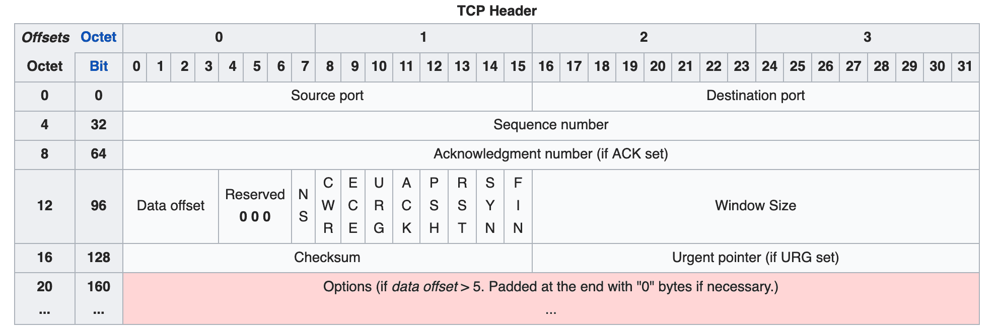
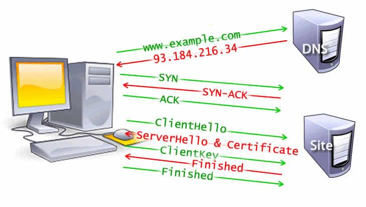
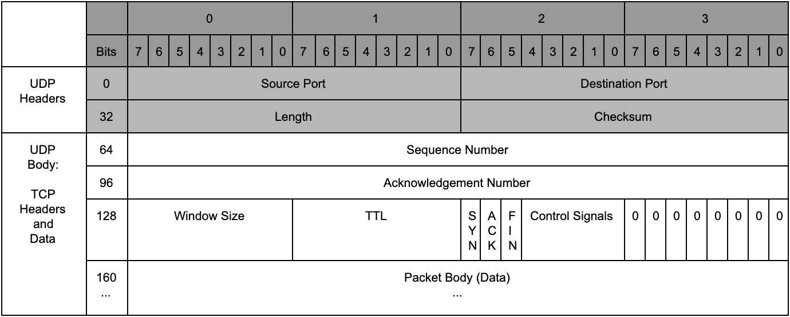

<!-- TOC -->
* [TCP](#tcp)
  * [1.1. Transport Layer](#11-transport-layer)
  * [1.2. 전송 계층이 없다면?](#12---)
  * [1.3. TCP 문제점](#13-tcp-)
* [UDP](#udp)
<!-- TOC -->

# TCP
1. 신뢰성 : 데이터를 순차적, 안정적인 전달
2. 전송 : 포트 번호에 해당하는 프로세스에 데이터를 전달

- 신뢰성 있는 데이터 통신을 가능하게 해주는 프로토콜
- Connection 연결 3way handshake 양방향 통신
- 데이터의 순차 전송 보장
- Flow control(흐름 제어)
- Congestion Control(혼잡 제어)
- Error Detection(오류 감지)
- data를 내부적으로 cut하여 TCP header에 담는다.

## 1.1. Transport Layer
- End Point 간 **신뢰성** 있는 데이터 **전송**을 담당하는 계층

## 1.2. 전송 계층이 없다면?
1. 데이터의 순차 전송 원활히 이루어지지 않는다.
2. 흐름 문제  
원인 : 송수신자 간의 데이터 처리 속도 차이
3.  혼잡 문제  
원인 : 네트워크의 데이터 처리 속도  
   네트워크가 혼잡할 때

## 1.3. TCP 문제점
- 전송의 신뢰성은 보장하지만 매번 Connection를 연결해서 시간 손실 발생(3 way-handshake)
- 패킷을 조금만 손실해도 재전송

# UDP
- TCP보다 신뢰성이 떨어지지만 전송 속도가 일반적으로 빠른 프로토콜
- Connectionless
- Error Detection
- 바교적 데이터의 신뢰성이 중요하지 않을 때 사용 (ex - 영상 스트리밍)
- packet                                         

추가 참고 문서
- https://developer.mozilla.org/en-US/docs/Web/Performance/How_browsers_work
- https://evan-moon.github.io/2019/11/10/header-of-tcp/